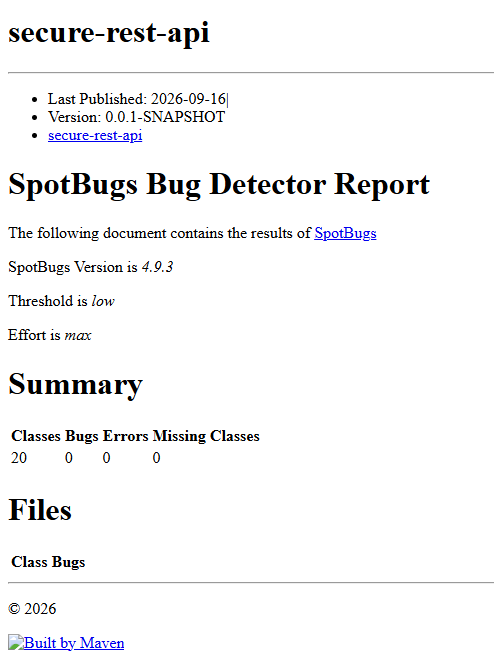
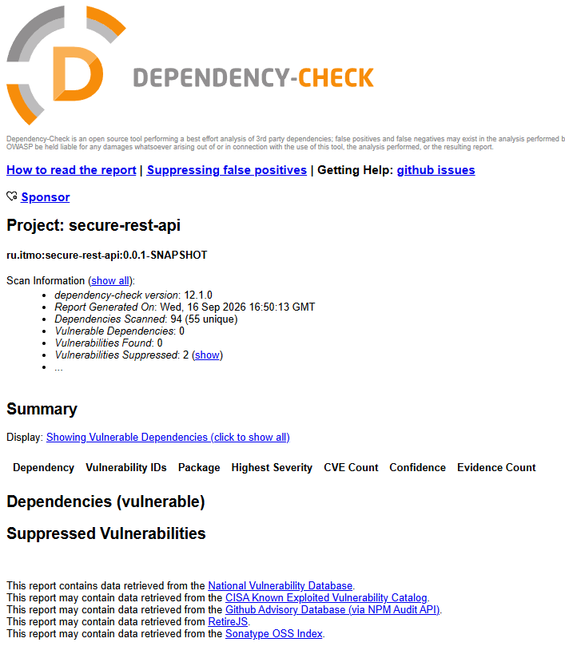

# Secure REST API — лабораторная работа №1

## 1. Технологии и структура проекта

- Java 21;
- Spring Boot 4.1.1, Spring Web, Spring Security;
- PostgreSQL 16 и Spring Data JPA/Hibernate;
- JWT и BCrypt;
- Jsoup;
- Maven, Docker Compose;
- SpotBugs, OWASP Dependency-Check и GitHub Actions.

```text
src/main/java/ru/itmo/secureapi/
├── controller/   REST-контроллеры и HTTP-запросы
├── service/      бизнес-логика
├── repository/   доступ к данным через Spring Data JPA
├── entity/       JPA-сущности
├── dto/          объекты запросов и ответов
└── security/     JWT, BCrypt, XSS-sanitizer и Spring Security
```

## 2. API и примеры вызовов

### Регистрация

```http
POST /auth/register
Content-Type: application/json
```

```json
{
  "username": "12345678",
  "password": "12345678"
}
```

### Вход и получение JWT

```http
POST /auth/login
Content-Type: application/json
```

```json
{
  "username": "12345678",
  "password": "12345678"
}
```

Успешный ответ содержит токен:

```json
{
  "token": "eyJhbGciOiJIUzI1NiJ9..."
}
```

### Список endpoint-ов

| Метод | Endpoint | Авторизация | Назначение |
|---|---|---|---|
| `POST` | `/auth/register` | Не требуется | Регистрация пользователя |
| `POST` | `/auth/login` | Не требуется | Проверка пароля и выдача JWT |
| `GET` | `/api/data` | Требуется JWT | Получение защищённых данных |
| `POST` | `/api/data` | Требуется JWT | Создание записи |
| `GET` | `/api/me` | Требуется JWT | Профиль текущего пользователя |

Postman-коллекция находится в `postman/Secure REST API.postman_collection.json`.

## 3. Реализованные меры защиты

### Защита от SQL Injection

Приложение не формирует SQL через конкатенацию пользовательских строк. Доступ к PostgreSQL выполняется через Spring Data JPA и репозитории. JPA использует подготовленные запросы и связывание параметров, поэтому пользовательский ввод не интерпретируется как SQL-код.

### Защита от XSS

Поля пользователя очищаются компонентом `security/Sanitizer` с помощью Jsoup и `Safelist.none()`:

- HTML-теги и JavaScript удаляются перед сохранением;
- данные дополнительно очищаются перед возвратом в ответе;
- ввод `<script>alert(1)</script>` не возвращается как исполняемый HTML.

### JWT-аутентификация

1. Пользователь отправляет логин и пароль на `/auth/login`.
2. `UserDetailsService` загружает пользователя из базы.
3. Введённый пароль сравнивается с BCrypt-хэшем.
4. При успехе `JwtService` создаёт подписанный HMAC-токен.
5. `JwtAuthenticationFilter` извлекает токен из `Authorization`.
6. Проверяются подпись и срок действия токена.
7. Только после успешной проверки запрос считается аутентифицированным.

HTTP-сессии отключены, поэтому API работает в stateless-режиме.

### Хэширование паролей

Пароли не хранятся в открытом виде. Перед сохранением используется `BCryptPasswordEncoder` с work factor `12`. В базе хранится только BCrypt-хэш.

### Дополнительные меры

- валидация входных DTO через Jakarta Validation;
- JWT-секрет и параметры БД задаются через переменные окружения;
- защищённые endpoint-ы требуют аутентификацию;

## 4. SAST и SCA

### SAST — SpotBugs

SpotBugs анализирует скомпилированный Java-байткод и ищет потенциально опасные конструкции:



```bash
mvn clean verify
```

### SCA — OWASP Dependency-Check

OWASP Dependency-Check анализирует Maven-зависимости по базе известных CVE:



```bash
mvn clean verify
```
